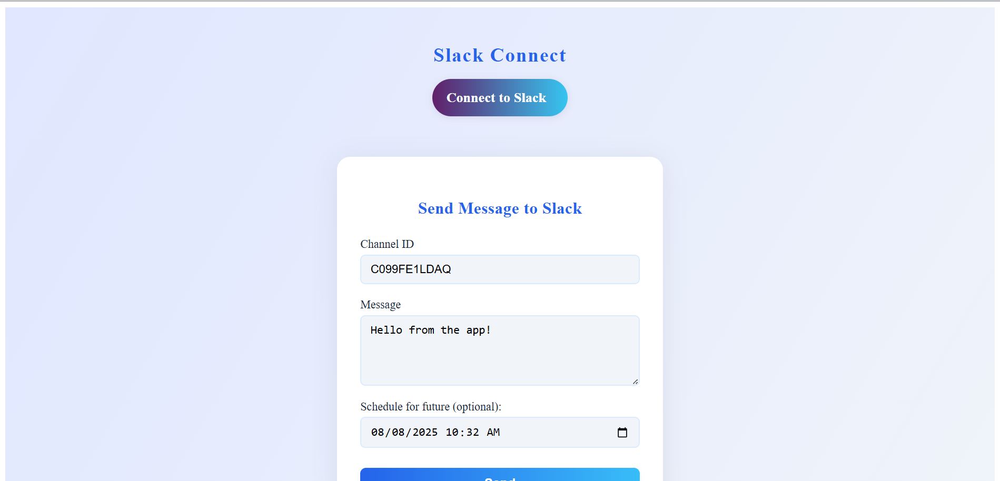
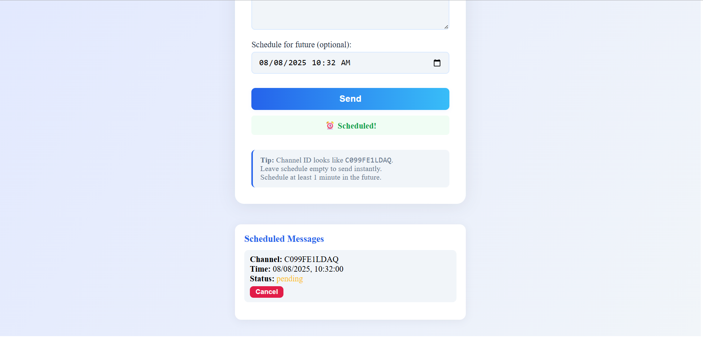
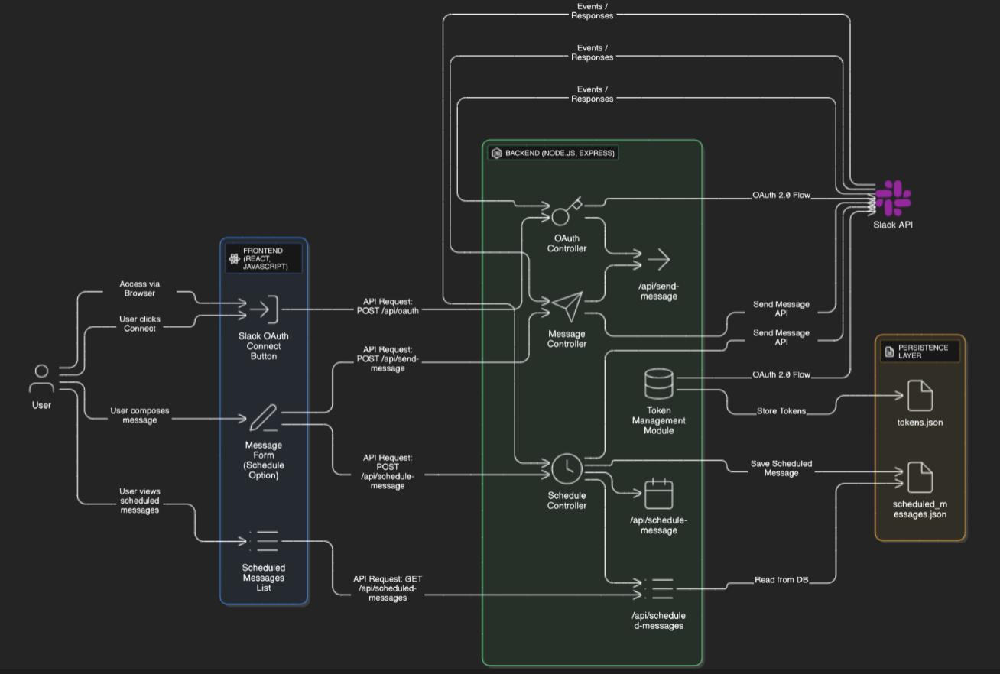

# Slack Connect

A full-stack web application that allows users to securely connect their Slack workspace, send messages instantly, and schedule messages for future delivery — all using JavaScript, Node.js (Express), React, and JSON files for storage.

---

## 🚀 Features

* **OAuth 2.0 Slack Workspace Integration**
* **Secure Token Management (JSON file-based)**
* **Send Messages Instantly to Any Channel**
* **Schedule Messages for Later Delivery**
* **Modern React UI**
* **View & Cancel Scheduled Messages**
* **Fully documented and easily extensible**

---

## 🖼️ Screenshots


   
   
   
   

---

## 🖼️ Architecture Diagram

   
   
   

---

## 🛠️ Tech Stack

* **Frontend:** React (JavaScript), Axios, CSS
* **Backend:** Node.js, Express.js
* **Persistence:** JSON files (for tokens & scheduled messages)
* **OAuth:** Slack API
* **Dev Environment:** GitHub Codespaces

---

## 📦 Project Structure

```
slack-connect/
  ├── backend/
  │     ├── controllers/
  │     ├── routes/
  │     ├── services/
  │     ├── utils/
  │     ├── data/
  │     ├── app.js
  │     └── server.js
  ├── frontend/
  │     ├── public/
  │     ├── src/
  │     │     ├── components/
  │     │     ├── App.js
  │     │     └── index.js
  │     └── package.json
  ├── README.md
  └── .gitignore
```

---

## ⚙️ Getting Started

### 1. **Clone the Repository**

```bash
git clonehttps://github.com/ShiKha99K/Assignment_COBALT/slack-connect.git
cd slack-connect
```

### 2. **Setup Backend**

```bash
cd backend
npm install
npm start
```

### 3. **Setup Frontend**

```bash
cd ../frontend
npm install
npm start
```

### 4. **Configure Slack App**

* Create a Slack app at [https://api.slack.com/apps](https://api.slack.com/apps).
* Set **OAuth Redirect URL** to:
  `https://<your-backend-url>/auth/slack/callback`
* Add necessary scopes under “OAuth & Permissions”:
  `chat:write`, `channels:read`
* Enable a Bot User (App Home).
* Install/Reinstall the app to your workspace.

---

## 🔐 Environment Variables

**Backend:**

* `SLACK_CLIENT_ID`
* `SLACK_CLIENT_SECRET`
* `SLACK_REDIRECT_URI`
* `FRONTEND_URL`
* `PORT`

**Frontend:**

* `REACT_APP_API_BASE_URL`
* `REACT_APP_AUTH_URL`

---

## 📖 API Reference

| Endpoint                        | Method | Description                             | Request Body Example                                                        |
| ------------------------------- | ------ | --------------------------------------- | --------------------------------------------------------------------------- |
| `/api/send-message`             | POST   | Send a message to a channel immediately | `{ "channel": "C099FE1LDAQ", "text": "Hello!" }`                            |
| `/api/schedule-message`         | POST   | Schedule a message for future delivery  | `{ "channel": "C099FE1LDAQ", "text": "Hi!", "sendAt": "2024-08-07T21:10" }` |
| `/api/scheduled-messages`       | GET    | List all scheduled messages             | *N/A*                                                                       |
| `/api/cancel-scheduled-message` | POST   | Cancel a scheduled message              | `{ "id": "SCHEDULED_MESSAGE_ID" }`                                          |
---

## 📚 Architectural Overview

* **Frontend (React):** Provides a simple UI. Talks only to the backend.
* **Backend (Express):** Handles OAuth, stores tokens, provides API for sending messages.
* **Storage:** Tokens (and scheduled messages if added) are stored in backend/data/ JSON files. No database required!
* **Security:** All tokens are handled server-side, never exposed to the frontend.

---

## 🤔 Challenges & Learnings

* Handling Slack’s OAuth flow with just JSON for persistence is straightforward for demos

* Concurrency caution: For multi-user, a database is safer than JSON files

* Frontend never sees tokens for security; only backend communicates with Slack

---

## 🎉 Credits

* Inspired by [Slack API docs](https://api.slack.com/)
* Built by Shikha Kumari

---

